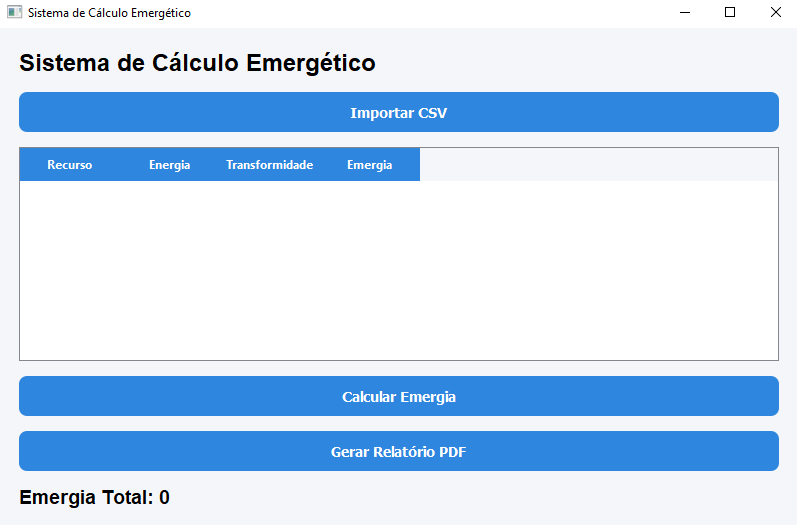

# Sistema de Cálculo Emergético

## Sobre o Projeto

Sistema desenvolvido em Python para automatizar cálculos emergéticos aplicados à análise ambiental.

Permite importar dados CSV, realizar cálculos, gerar gráficos e emitir relatórios PDF.

---

## Interface

---

## Funcionalidades

- Importação CSV
- Cálculo emergético
- Geração de gráficos
- Relatórios PDF
- Banco SQLite

---

## Tecnologias

- Python
- PyQt5
- Pandas
- SQLite
- Matplotlib
- ReportLab